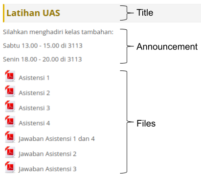

# Scele Crawler

[](https://www.npmjs.com/package/scele-crawler)

[](https://travis-ci.org/scele-crawler/scele-crawler)
[](https://coveralls.io/github/scele-crawler/scele-crawler?branch=master)


## API Documentation

### Install
```bash
npm i --save scele-crawler
```

### Import
```js
const sceleCrawler = require("scele-crawler");
```

### Login
```js
await sceleCrawler.login("SSO-USERNAME", "SSO-PASSWORD");
```

### Profile
```js
const profile = sceleCrawler.getProfile();

console.log(profile.npm);
console.log(profile.fullName);
console.log(profile.nickName);
```

### Courses
```js
const courses = sceleCrawler.getCourses();

courses.forEach(course => {
    console.log(course.longTitle);
    console.log(course.shortTitle);
});
```

### Fetch Course Detail
```js
const courseInfo = await courses[0].fetchInfo();
```



### Title
```js
Object.keys(courseInfo).forEach(title => {
    console.log(title);
});
```

### Announcement
```js
console.log(courseInfo[title].announcement);
```

### Files
```js
courseInfo[title].files.forEach(file => {
    console.log(file.fileName)
    console.log(file.fileType);
    console.log(file.link);
});
```