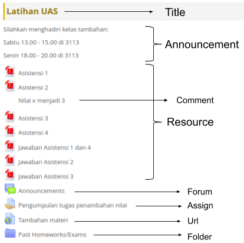

# Scele Crawler

[](https://www.npmjs.com/package/scele-crawler)


## API Documentation

### Install
```bash
npm i --save scele-crawler
```

### Import
```js
const sceleCrawler = require("scele-crawler");
```

### Login
```js
await sceleCrawler.login("SSO-USERNAME", "SSO-PASSWORD");
```

### Profile
```js
const profile = sceleCrawler.getProfile();

console.log(profile.npm);
console.log(profile.fullName);
console.log(profile.nickName);
```

### Courses
```js
const courses = sceleCrawler.getCourses();

for (const course of sceleCrawler.getCourses()) {
    console.log(course.longTitle);
    console.log(course.shortTitle);
}
```

### Fetch Course Detail
```js
const courseDetail = await courses[0].fetchDetail();
```



### Title
```js
for (const detail of courseDetail) {
    console.log(detail);
}
```

### Announcement
```js
console.log(courseDetail[title].announcement);
```

### Content
```js
for (const content of courseDetail[title].contents) {
    console.log(content.title)
    console.log(content.type);
    console.log(content.link);
    console.log(content.comment);
}
```
